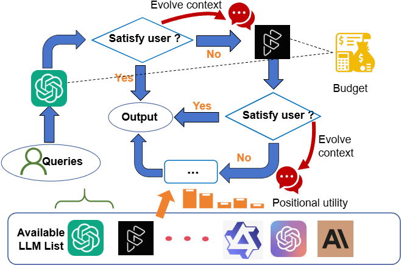
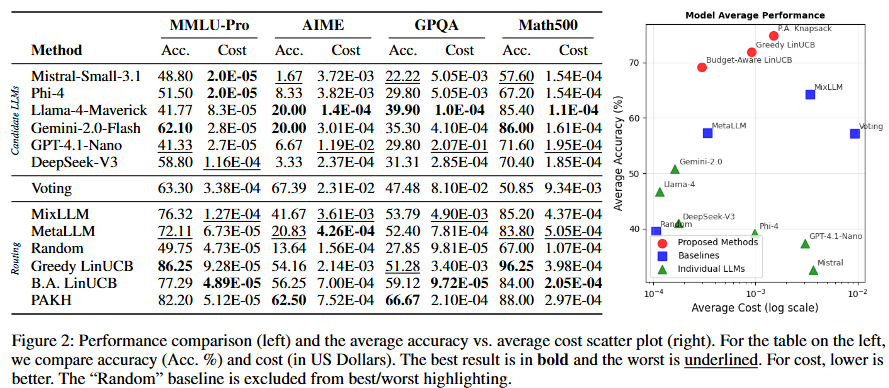

<div align="center">
    <h1> [AAAI'26] Online Multi-LLM Selection via Contextual Bandits under Unstructured Context Evolution
</div>

<div align="center">
    <p>
        <strong>Official Python Implementation for our AAAI 2026 Paper</strong>
    </p>
    <p>
        <strong> One-click executable, no need to spend any time on environment configuration!</strong> 
    </p>
    <p>
        <a href="https://arxiv.org/abs/2506.17670">
            
        </a>
        <a href="https://www.python.org/">
            
        </a>
        <a href="LICENSE">
            
        </a>
    </p>
</div>

## 🎯 The Core Idea

Choosing the right Large Language Model (LLM) is hard. More powerful models are expensive and slow, while cheaper models often lack reasoning ability. This problem becomes even more challenging in real-world conversations, where a user's prompt evolves unpredictably based on the LLM's previous responses.

This repository provides the implementation for **"Online Multi-LLM Selection via Contextual Bandits under Unstructured Context Evolution."** We propose a lightweight and adaptive framework that treats this challenge as a **contextual bandit** problem. Our method intelligently selects the most suitable LLM at each turn of a conversation, based solely on the current context, and provably learns to make better, more cost-effective decisions over time—all without requiring complex environment simulations or offline training.

<div align="center">
    
    <br>
    <em>Figure 1: Our proposed framework for online multi-LLM selection.</em>
</div>

---

## ✨ Key Features

*   **Adaptive LLM Routing:** A theoretically-grounded framework for real-time LLM selection.
*   **Implementation of Three Core Algorithms:**
    1.  `Greedy LinUCB`: Optimizes for accuracy without budget constraints.
    2.  `Budget-Aware (B.A.) LinUCB`: Balances accuracy and cost to meet a defined budget.
    3.  `Positionally-Aware Knapsack (PAKH)`: A novel heuristic that prioritizes high-quality responses early in an interaction, mimicking user preference.
*   **Experiment Replication:** Code to replicate the experiments on the **Math500** dataset, as presented in our paper.

---

## 📊 Visualizing the Performance

Our methods consistently achieve a better trade-off between accuracy and operational cost compared to baseline approaches, occupying the desirable top-left region of the performance plot.


<div align="center">
    
    <br>
    <em>Figure 2: Average accuracy vs. average cost. Our proposed methods (circles) outperform baselines.</em>
</div>

---

## 🚀 Getting Started

### 1. Clone the Repository

```bash
git clone https://github.com/EntroShape/Online-Multi-LLM-Selection.git
cd Online-Multi-LLM-Selection
```

### 2. Install Dependencies

It is recommended to use a virtual environment.

```bash
# Create and activate a virtual environment (optional but recommended)
python -m venv venv
source venv/bin/activate  # On Windows, use `venv\Scripts\activate`

# Install required packages
pip install -r requirements.txt
```

### 3. Set Up Your API Key

Our framework uses the [OpenRouter API](https://openrouter.ai/) to access various LLMs.

Create a file named `.env` in the root of the project directory and add your OpenRouter API key to it:

```env
# .env file
OPENROUTER_API_KEY="your-secret-api-key-here"
```

### 4. Prepare the Dataset

This repository includes the code for the Math500 dataset experiments.

1.  Download the dataset from its original source.
2.  Place the dataset files into a `./data/math500/` directory within the project.

---

## 💻 Running the Experiments

The implementation for each of our core algorithms is provided in a separate Jupyter Notebook located in the `Algorithm/` directory.

### Algorithm Notebooks

| Filename | Algorithm Name | Description |
| :--- | :--- | :--- |
| **`Algo1.ipynb`** | Budget-Aware (B.A.) LinUCB |  Maximizes accuracy at each step without budget constraints.  |
| **`Algo2.ipynb`** | Greedy LinUCB | Maximizes accuracy while staying within a cost budget. |
| **`Algo3.ipynb`** | Positionally-Aware Knapsack (PAKH) | Uses a knapsack heuristic to prioritize strong LLMs with budget consideration. |

### How to Run

Before running the notebooks, please ensure you have completed the setup steps:
✅ The `.env` file with your OpenRouter API key is created.
✅ The Math500 dataset is located in the `./data/math500/` directory.

1.  **Start Jupyter Lab or Notebook** from your terminal in the project's root directory:
    ```bash
    jupyter lab
    # OR
    jupyter notebook
    ```
2.  **Navigate to the `Algorithm/` Directory** in the Jupyter interface.
3.  **Open the Notebook** you wish to run (e.g., `Algo3.ipynb` for the PAKH algorithm).
4.  **Execute the Cells:** You can run all cells in the notebook to execute the full experiment from start to finish. The notebooks are self-contained and will guide you through the process.

## 📜 Citation

If you find our work useful in your research, please consider citing our paper:

```bibtex
@inproceedings{poon2026multillm,
  title={{Online Multi-LLM Selection via Contextual Bandits under Unstructured Context Evolution}},
  author={Poon, Manhin and Dai, XiangXiang and Liu, Xutong and Kong, Fang and Lui, John C.S. and Zuo, Jinhang},
  booktitle={Proceedings of the AAAI Conference on Artificial Intelligence},
  volume={40},
  year={2026}
}
```

## 🙏 Acknowledgements

*   We thank the creators of the [Math500 dataset](https://github.com/hendrycks/math) for their contribution to the community.
*   This framework is powered by the excellent services provided by [OpenRouter](https://openrouter.ai/).
